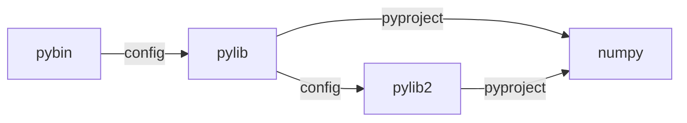

# Example Project
## Dependency

- python dependency in *python crate* (`pylib`, `pylib2`) should be specified in `crate_python::config!`.
- other python dependency (`numpy`) should be  specified in `pyproject.toml`   